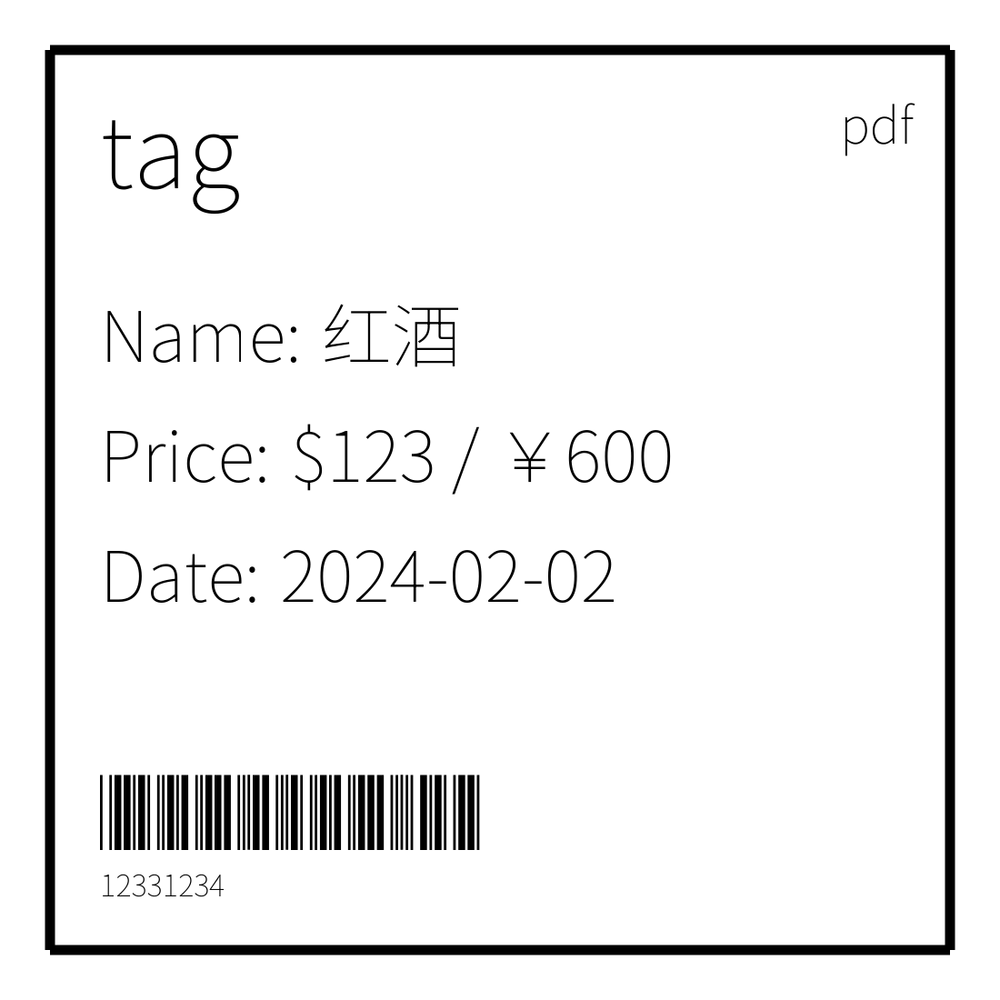

# pdf生成器

一个基于`https://github.com/signintech/gopdf`的web服务pdf生成器

`go run . -h`

->

POST
```json
{
  "fonts": [
    {
      "family": "NotoSans",
      "loc": "SourceHanSansSC-VF.ttf"
    },
    {
      "family": "3of9",
      "loc": "free3of9.ttf"
    }
  ],
  "pageSizeWH": [100, 100],
  "font": {
    "family": "NotoSans",
    "size": 7
  },
  "wh": [80, 12],
  "page": [
    {
      "object": [
        {
          "type": "line",
          "xy": [
            [5, 5, 90, 0],
            [-1, -1, 0, 90],
            [-1, -1, -90, 0],
            [-1, -1, 0, -90]
          ],
          "wh": [1, 0]
        },
        {
          "type": "xy",
          "xy": [[10, 10]]
        },
        {
          "type": "text",
          "value": "tag",
          "font":{"size": 10},
          "flex": "x"
        },
        {
          "type": "text",
          "value": "pdf",
          "font":{"size": 5},
          "offset": [60,0],
          "flex": "x"
        },
        {
          "type": "br",
          "wh": [0, 20]
        },
        {
          "type": "text",
          "value": "Name:",
          "flex": "x"
        },
        {
          "type": "text",
          "value": "红酒",
          "offset": [2,0],
          "flex": "x"
        },
        {
          "type": "br"
        },
        {
          "type": "text",
          "value": "Price:",
          "flex": "x"
        },
        {
          "type": "text",
          "value": "$123 / ￥600",
          "offset": [2,0],
          "flex": "x"
        },
        {
          "type": "br"
        },
        {
          "type": "text",
          "value": "Date:",
          "flex": "x"
        },
        {
          "type": "text",
          "value": "2024-02-02",
          "offset": [2,0],
          "flex": "x"
        },
        {
          "type": "text",
          "font": { "family": "3of9", "size": 10 },
          "xy": [[10,75]],
          "value": "*12331234*",
          "flex": "x"
        },
        {
          "type": "br"
        },
        {
          "type": "text",
          "xy": [[10,87]],
          "value": "12331234",
          "font":{"size": 3},
          "flex": "x"
        }
      ]
    }
  ]
}
```

<-


